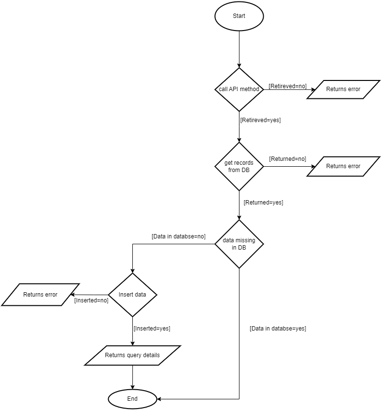

# Read SAP Master Inspection data and Update your MySQL database

This example demonstrates how to use Ballerina to interact with the `sap.s4hana.api_masterinspcharacteristic_srv:Client` for accessing S/4HANA Quality Management module data, and then updating a MySQL database based on this information.

The example works as follows:


 
## Prerequisites

### 1. Setup the S/4HANA API

Refer to the [Setup Guide](https://central.ballerina.io/ballerinax/sap/latest#setup-guide) for obtaining necessary credentials (
hostname, username, password) to acess the S/4HANA API.

### 2. Setup a database server

Set up a MySQL database using your preferred client. Create the following table schema:

```sql
USE database_name;

CREATE TABLE Ins_Spec_Directory (
    InspectionSpecification VARCHAR(8),
    InspectionSpecificationVersion VARCHAR(6),
    InspectionSpecificationPlant VARCHAR(4),
    Plant VARCHAR(50),
    ValidityStartDate VARCHAR(15),
    InspectionSpecificationSrchTxt VARCHAR(60),
    InspSpecGlobalName VARCHAR(60),
    InspSpecChangeDate VARCHAR(15),
    PRIMARY KEY (InspectionSpecification, InspectionSpecificationVersion, InspectionSpecificationPlant)
);
```

### 2. Setup MySQL Client

Ensure the MySQL client setup is completed. For more details, Refer to the [MySQL package documentation](https://central.ballerina.io/ballerinax/mysql/latest) to learn more.

### 3. Configuration

In the example directory, create a `Config.toml` file to configure the database credentials and S/4HANA API. Add your credentials there:

```toml
[s4hanaClientConfig]
hostname = "<Hostname>"
username = "<Username>"
password = "<Password>"

[databaseConfig]
host = "<MySQL host>"
username = "<MySQL username>"
password = "<MySQL password>"
databaseName = "<MySQL databaseName>"
port = "<MySQL port>"
```

## Run the Example

Execute the following command to run the example:

```bash
bal run
```
